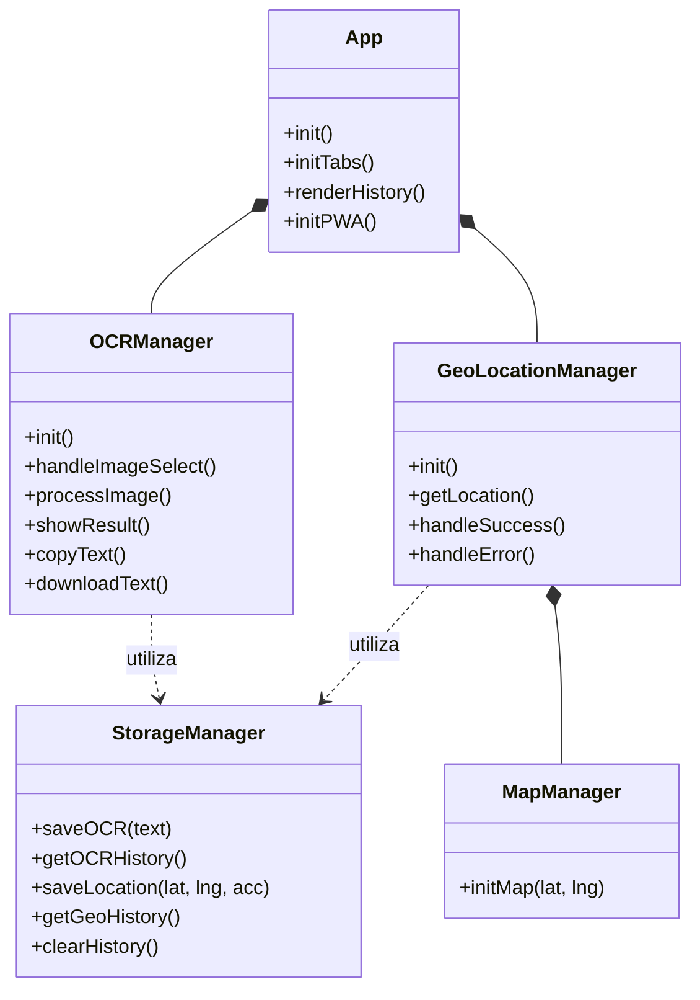

# Diagrama de Componentes

Este diagrama muestra los distintos módulos de la aplicación y cómo interactúan entre sí a nivel de código (JavaScript Vainilla).

## Descripción de Módulos
- **App**: Orquestador principal. Inicializa los otros gestores y controla la instalación de la PWA.
- **OCRManager**: Maneja la interacción con Tesseract.js.
- **GeoLocationManager**: Interactúa con la Geolocation API.
- **MapManager**: Renderiza los mapas mediante Leaflet.js.
- **StorageManager**: Funciones estáticas para interactuar con `localStorage`.
