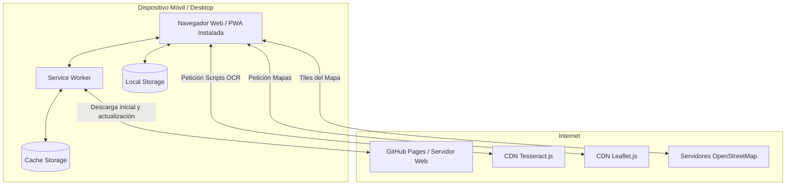

# Diagrama de Despliegue

Este diagrama ilustra la arquitectura de despliegue físico y lógico de la aplicación PWA.

## Arquitectura de Despliegue
La aplicación está diseñada para ser completamente estática (Client-Side). Se puede alojar en cualquier servidor web estático moderno (como GitHub Pages, Vercel, Netlify). 
- Los motores pesados (Tesseract) se cargan vía CDN para optimizar el almacenamiento inicial y aprovechar las cachés globales del navegador.
- Los mapas se consultan directamente a OpenStreetMap, mitigando la necesidad de un backend propio para tiles.
- Al instalarse como PWA, el Service Worker abstrae la capa de red permitiendo que el sistema funcione desconectado.
