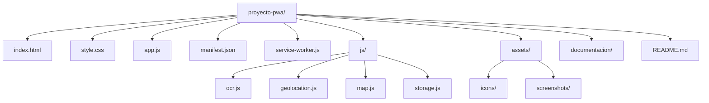

# Estructura del Proyecto

## Convenciones de Código
- La estructura está pensada para separar responsabilidades. El archivo `app.js` es el punto de entrada y el que coordina.
- Cada archivo dentro de `js/` se exporta como módulo de ES6 para mantener un código limpio y asilado.
- Los iconos y assets visuales residen en la carpeta `assets/`, requeridos para el `manifest.json`.
- La documentación vive en `documentacion/` para no saturar el nivel raíz.
